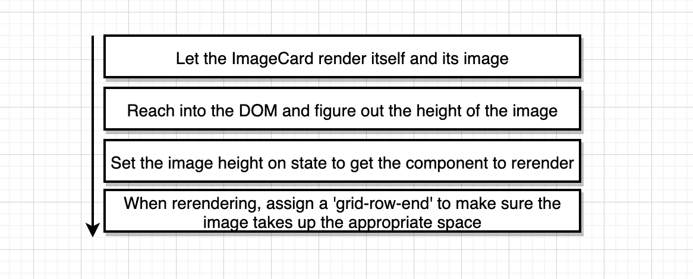
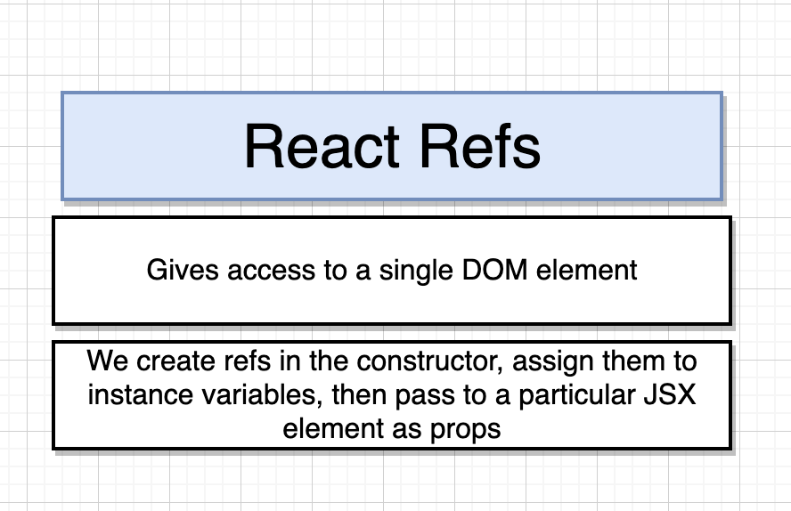

# Pics

This is a simple application that allows a user to search for images using a keyword, connects to the [unsplash api](https://unsplash.com/developers) to retrieve images, and then tiles the responses in an aestetically pleasing manner.

The search bar component contains good reference cases for event handling. The image list contains good reference cases for rendering lists and the React refs system used for referencing the DOM.

To start the project locally:
```
npm start
```

## Different user events


## Flow of a controled event


## Flow of requests to Unsplash API


## Flow from rendering to displaying images


## Process flow for images to render in grid


## React Refs description
