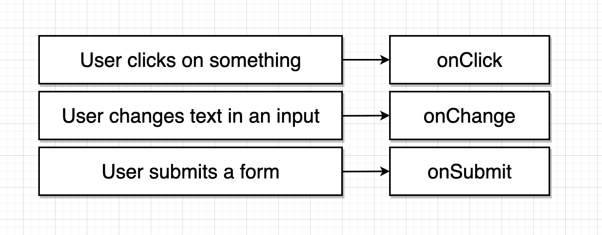
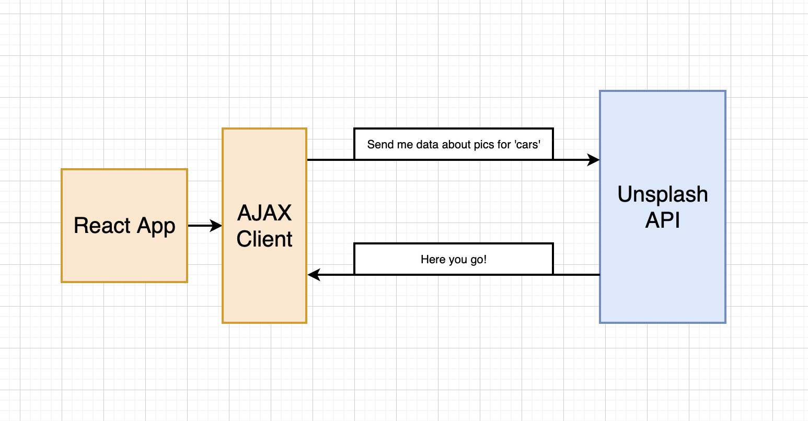
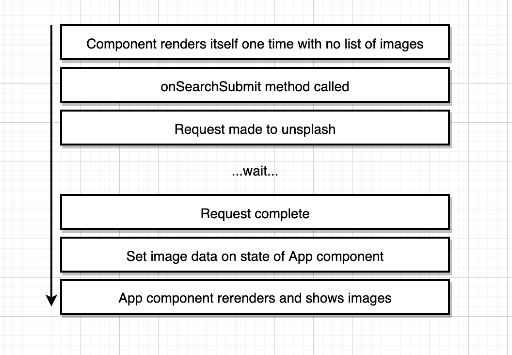

# Pics

Insert Simple app description here

To start the project locally:
```
npm start
```

## Different user events


## Flow of a controled event


## Flow of requests to Unsplash API


## Flow from rendering to displaying images
